# buffa

[](https://crates.io/crates/buffa)
[](https://docs.rs/buffa)
[](https://github.com/anthropics/buffa/actions/workflows/ci.yml)
[](Cargo.toml)
[](https://deps.rs/repo/github/anthropics/buffa)
[](docs/guide.md#no_std-usage)
[](LICENSE)

A pure-Rust Protocol Buffers implementation with first-class [protobuf editions](https://protobuf.dev/editions/overview/) support. Written by Claude and friends ❣️

## Why buffa?

The Rust ecosystem lacks an actively maintained, pure-Rust library that supports [protobuf editions](https://protobuf.dev/editions/overview/). Buffa fills that gap with a ground-up design that treats editions as the core abstraction. It passes the full protobuf conformance suite — binary, JSON, and text — with zero expected failures.

## Features

- **Editions-first.** Proto2 and proto3 are understood as feature presets within the editions model. One code path, parameterized by resolved features.

- **Two-tier owned/borrowed types.** Each message generates both `MyMessage` (owned, heap-allocated) and `MyMessageView<'a>` (zero-copy from the wire). `OwnedView<V>` wraps a view with its backing `Bytes` buffer for use across async boundaries.

- **`MessageField<T>`.** Optional message fields deref to a default instance when unset -- no `Option<Box<T>>` unwrapping ceremony.

- **`EnumValue<T>`.** Type-safe open enums with proper Rust `enum` types and preservation of unknown values, instead of raw `i32`.

- **Linear-time serialization.** Cached encoded sizes prevent the exponential blowup that affects libraries without a size-caching pass.

- **Unknown field preservation.** Round-trip fidelity for proxy and middleware use cases.

- **Runtime reflection.** `buffa-descriptor` (under the `reflect` feature) provides `DescriptorPool` and `DynamicMessage` for schema-driven encode, decode, and JSON without generated code — plus extensions, custom-option access, `Any` pack/unpack, and symbol→file lookup for gRPC server reflection. Generated types implement the same `ReflectMessage` trait directly (vtable mode), so `foo.reflect()` borrows in place and a CEL evaluator, transcoding gateway, or generic interceptor treats typed and dynamic messages uniformly — without a re-encode round-trip. See [Reflection](#reflection) for the cost relative to generated code.

- **`no_std` + `alloc`.** The core runtime works without `std`, including JSON serialization via serde. Enabling `std` adds `std::io` integration, `std::time` conversions, and thread-local JSON parse options.

## Wire formats

buffa supports **binary**, **JSON**, and **text** protobuf encodings:

- **Binary wire format** -- full support for all scalar types, nested messages, repeated/packed fields, maps, oneofs, groups, and unknown fields.

- **Proto3 JSON** -- canonical protobuf JSON mapping via optional `serde` integration. Includes well-known type serialization (Timestamp as RFC 3339, Duration as `"1.5s"`, int64/uint64 as quoted strings, bytes as base64, etc.).

- **Text format (`textproto`)** -- the human-readable debug format. Covers `Any` expansion (`[type.googleapis.com/...] { ... }`), extension bracket syntax (`[pkg.ext] { ... }`), and group/DELIMITED fields. `no_std`-compatible.

## Unsupported features

These are intentionally out of scope:

- **Proto2 optional-field getter methods** — `[default = X]` on `optional` fields does not generate `fn field_name(&self) -> T` unwrap-to-default accessors. Custom defaults are applied only to `required` fields via `impl Default`. Optional fields are `Option<T>`; use pattern matching or `.unwrap_or(X)`.
- **Scoped `JsonParseOptions` in `no_std`** — serde's `Deserialize` trait has no context parameter, so runtime options must be passed through ambient state. In `std` builds, [`with_json_parse_options`] provides per-closure, per-thread scoping via a thread-local. In `no_std` builds, [`set_global_json_parse_options`] provides process-wide set-once configuration via a global atomic. The two APIs are mutually exclusive. The `no_std` global supports singular-enum accept-with-default but not repeated/map container filtering (which requires scoped strict-mode override).

[`with_json_parse_options`]: https://docs.rs/buffa/latest/buffa/json/fn.with_json_parse_options.html
[`set_global_json_parse_options`]: https://docs.rs/buffa/latest/buffa/json/fn.set_global_json_parse_options.html

## Known limitations

These are gaps we intend to address in future releases:

- **Closed-enum unknown values in packed-repeated view decode** are silently dropped (not routed to unknown fields). The owned decoder handles this correctly; the view decoder handles singular, optional, oneof, and unpacked repeated correctly. Packed blobs have no per-element tag to borrow, so the zero-copy `UnknownFieldsView<'a>` has no span to reference.
- **Closed-enum unknown values in map values** are silently dropped (not routed to unknown fields). The proto spec requires the entire map entry (key + value) to go to unknown fields, which requires re-encoding. This affects proto2 schemas with `map<K, ClosedEnum>` where an evolved sender adds new enum values.

## Semver and API stability

Buffa is pre-1.0. We follow the [Rust community convention](https://doc.rust-lang.org/cargo/reference/semver.html) for 0.x crates: breaking changes increment the **minor** version (0.1.x → 0.2.0), additive changes increment the **patch** version (0.1.0 → 0.1.1). Pin to a minor version (`buffa = "0.6"`) to avoid surprises.

The generated code API (struct shapes, `Message` trait, `MessageView` trait, `EnumValue`, `MessageField`) is considered the primary stability surface. Internal helper modules marked `#[doc(hidden)]` (`__private`, `__buffa_*` fields) may change at any time.

## Quick start

### Using `buf generate` (recommended)

Install [buf](https://buf.build/docs/installation), then create a `buf.gen.yaml` that uses the published [`buf.build/anthropics/buffa`](https://buf.build/anthropics/buffa) remote plugin — no local plugin install required:

```yaml
version: v2
plugins:
  - remote: buf.build/anthropics/buffa
    out: src/gen
    opt:
      - file_per_package=true
      - json=true
```

```sh
buf generate
```

This emits one `<dotted.package>.rs` file per proto package. Wire them into your crate with a small `pub mod` tree:

```rust,ignore
// src/gen/mod.rs (hand-written)
pub mod example {
    pub mod v1 {
        include!("example.v1.rs");
    }
}
```

If you'd rather have the module tree generated for you, install [`protoc-gen-buffa-packaging`](docs/guide.md#installing-the-protoc-plugins) locally and add it as a second plugin (drop the `file_per_package=true` opt):

```yaml
version: v2
plugins:
  - remote: buf.build/anthropics/buffa
    out: src/gen
    opt:
      - json=true
  - local: protoc-gen-buffa-packaging
    out: src/gen
    strategy: all
```

See [`examples/bsr-quickstart/`](examples/bsr-quickstart/) for a complete, runnable project, or the [user guide](docs/guide.md#using-buf) for the full set of build setups (local plugins, `buffa-build`/`build.rs`, BSR-generated SDKs).

### Using `buffa-build` in `build.rs`

Alternatively, use `buffa-build` for a `build.rs`-based workflow (requires `protoc` on PATH):

```rust,ignore
// build.rs
fn main() {
    buffa_build::Config::new()
        .files(&["proto/my_service.proto"])
        .includes(&["proto/"])
        .compile()
        .unwrap();
}
```

### Encoding and decoding

```rust,ignore
use buffa::Message;

// Encode
let msg = MyMessage { id: 42, name: "hello".into(), ..Default::default() };
let bytes = msg.encode_to_vec();

// Decode (owned)
let decoded = MyMessage::decode_from_slice(&bytes).unwrap();

// Decode (zero-copy view)
let view = MyMessageView::decode_view(&bytes).unwrap();
println!("name: {}", view.name); // &str, no allocation

// Decode (owned view — zero-copy + 'static, for async/RPC use)
let owned_view = OwnedView::<MyMessageView>::decode(bytes.into()).unwrap();
println!("name: {}", owned_view.name); // still zero-copy, but 'static + Send
```

### JSON serialization (with `json` feature)

```rust,ignore
let json = serde_json::to_string(&msg).unwrap();
let decoded: MyMessage = serde_json::from_str(&json).unwrap();
```

## Documentation

- **[User Guide](docs/guide.md)** — comprehensive guide to buffa's API, generated code shape, encoding/decoding, views, JSON, well-known types, and editions support.
- **[Migrating from prost](docs/migration-from-prost.md)** — step-by-step migration guide with before/after code examples.
- **[Migrating from protobuf](docs/migration-from-protobuf.md)** — migration guide covering both stepancheg v3 and Google official v4.

## Workspace layout

| Crate | Purpose |
|---|---|
| `buffa` | Core runtime: `Message` trait, wire format codec, `no_std` support |
| `buffa-types` | Well-known types: Timestamp, Duration, Any, Struct, wrappers, etc. |
| `buffa-descriptor` | Protobuf descriptor types (`FileDescriptorProto`, `DescriptorProto`, ...) |
| `buffa-codegen` | Code generation from protobuf descriptors |
| `buffa-build` | `build.rs` helper for invoking codegen via `protoc` |
| `protoc-gen-buffa` | `protoc` plugin binary; also published as [`buf.build/anthropics/buffa`](https://buf.build/anthropics/buffa) |
| `protoc-gen-buffa-packaging` | `protoc` plugin that emits a `mod.rs` module tree (local-only) |

## Performance

Throughput comparison across five representative message types, measured on an Intel Xeon Platinum 8488C (x86_64) at buffa v0.5.0. Cross-implementation benchmarks run in Docker for toolchain consistency (`task bench-cross`). Higher is better.

### Binary decode

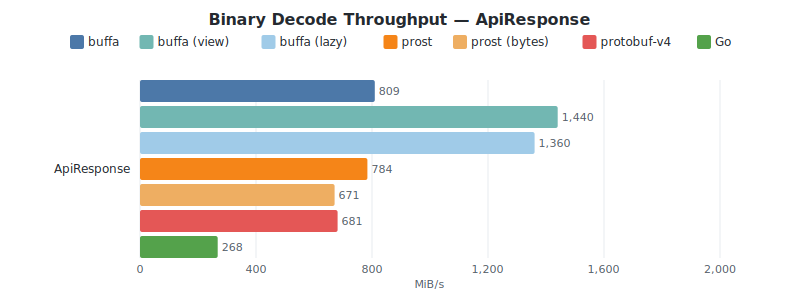
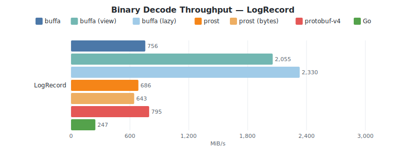
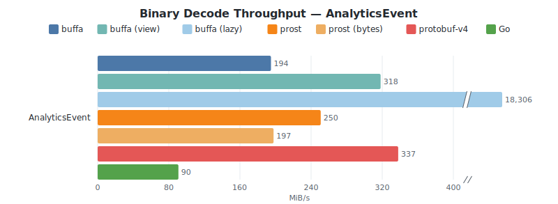
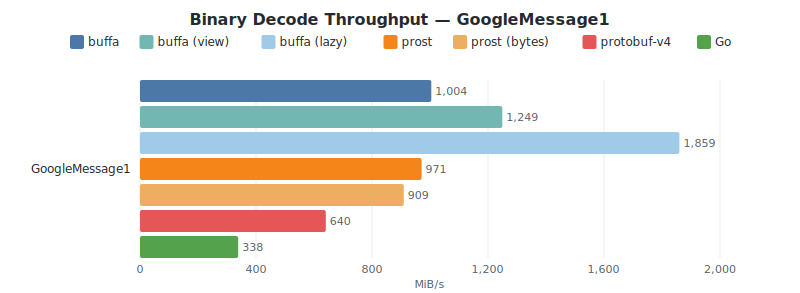
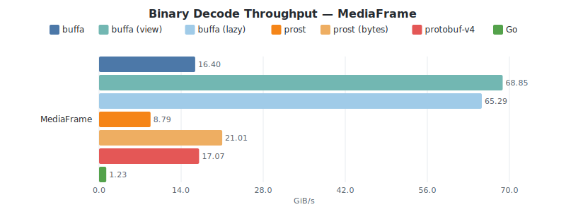

<details><summary>Raw data (MiB/s)</summary>

| Message | buffa | buffa (view) | prost | prost (bytes) | protobuf-v4 | Go |
|---------|------:|------:|------:|------:|------:|------:|
| ApiResponse | 825 | 1,399 (+70%) | 756 (−8%) | 677 (−18%) | 689 (−16%) | 272 (−67%) |
| LogRecord | 741 | 1,869 (+152%) | 735 (−1%) | 682 (−8%) | 867 (+17%) | 251 (−66%) |
| AnalyticsEvent | 192 | 317 (+65%) | 254 (+32%) | 197 (+3%) | 359 (+87%) | 91 (−53%) |
| GoogleMessage1 | 905 | 1,201 (+33%) | 989 (+9%) | 930 (+3%) | 643 (−29%) | 348 (−62%) |
| MediaFrame | 17,682 | 71,426 (+304%) | 9,612 (−46%) | 23,577 (+33%) | 17,894 (+1%) | 1,250 (−93%) |

</details>

### Binary encode

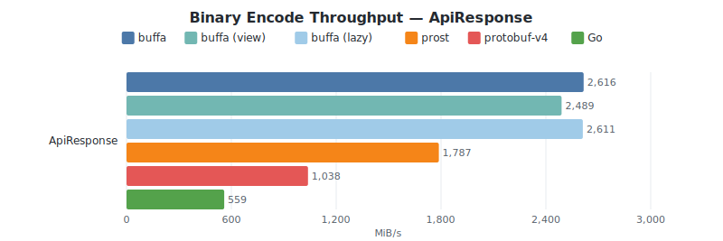
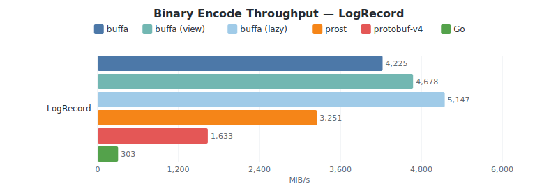
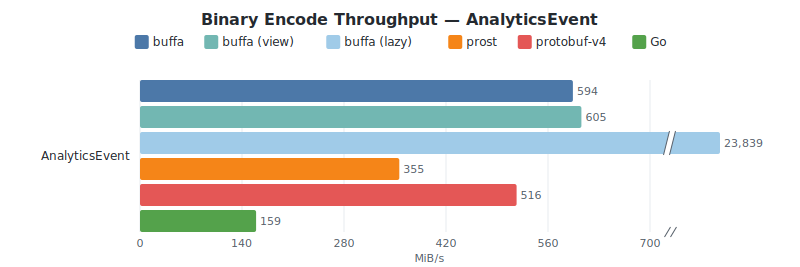
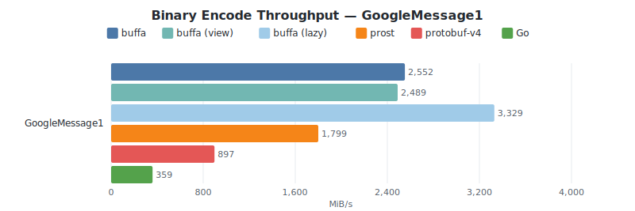
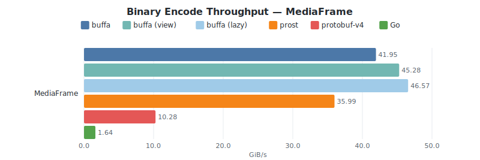

<details><summary>Raw data (MiB/s)</summary>

| Message | buffa | buffa (view) | prost | prost (bytes) | protobuf-v4 | Go |
|---------|------:|------:|------:|------:|------:|------:|
| ApiResponse | 2,566 | 2,537 (−1%) | 1,801 (−30%) | — | 1,033 (−60%) | 561 (−78%) |
| LogRecord | 4,029 | 4,703 (+17%) | 3,116 (−23%) | — | 1,651 (−59%) | 305 (−92%) |
| AnalyticsEvent | 582 | 623 (+7%) | 359 (−38%) | — | 509 (−13%) | 161 (−72%) |
| GoogleMessage1 | 2,441 | 2,725 (+12%) | 1,817 (−26%) | — | 865 (−65%) | 362 (−85%) |
| MediaFrame | 43,830 | 45,425 (+4%) | 38,652 (−12%) | — | 10,616 (−76%) | 1,673 (−96%) |

</details>

### Build + binary encode

The `build + encode` measure starts from raw field values rather than a pre-built
message struct, so it counts struct construction. The `buffa (view)` path
constructs a borrowed view directly over the input slices and never allocates an
owned message at all, which is why it is consistently faster than building owned
structs and then encoding them.

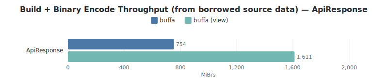
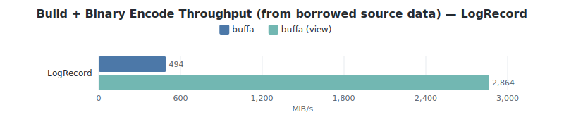
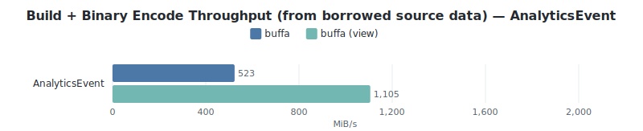
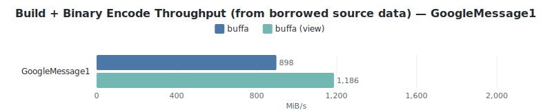
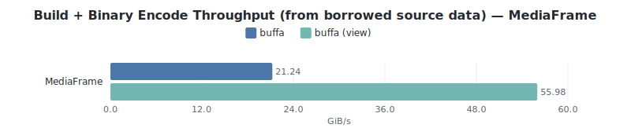

<details><summary>Raw data (MiB/s)</summary>

| Message | buffa | buffa (view) |
|---------|------:|------:|
| ApiResponse | 732 | 1,649 (+125%) |
| LogRecord | 498 | 2,843 (+471%) |
| AnalyticsEvent | 520 | 1,166 (+124%) |
| GoogleMessage1 | 818 | 1,169 (+43%) |
| MediaFrame | 20,893 | 52,910 (+153%) |

</details>

### JSON encode

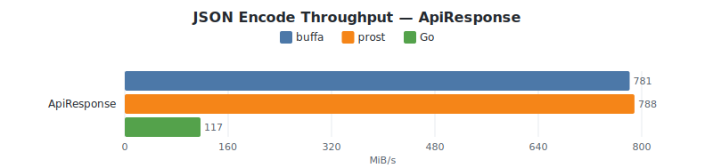
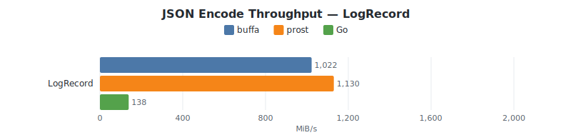
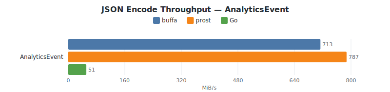
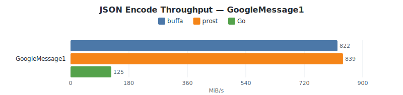
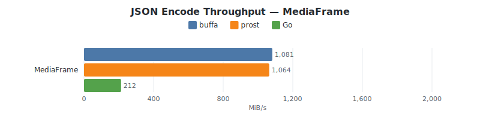

<details><summary>Raw data (MiB/s)</summary>

| Message | buffa | prost | Go |
|---------|------:|------:|------:|
| ApiResponse | 872 | 942 (+8%) | 115 (−87%) |
| LogRecord | 1,332 | 1,401 (+5%) | 139 (−90%) |
| AnalyticsEvent | 766 | 849 (+11%) | 52 (−93%) |
| GoogleMessage1 | 968 | 1,033 (+7%) | 125 (−87%) |
| MediaFrame | 1,460 | 1,445 (−1%) | 209 (−86%) |

</details>

### JSON decode

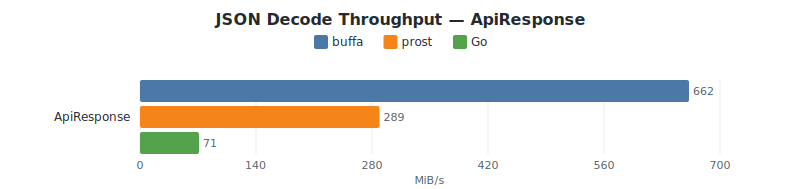
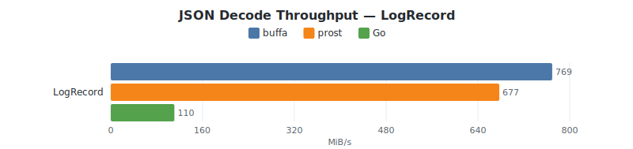

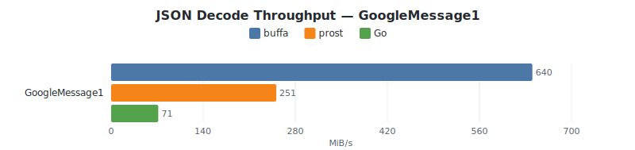
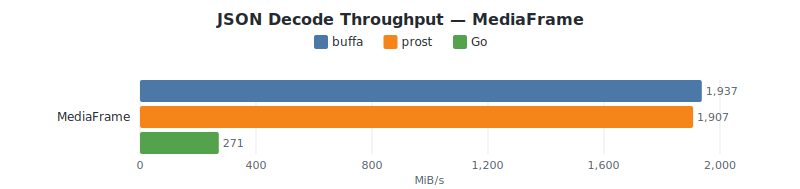

<details><summary>Raw data (MiB/s)</summary>

| Message | buffa | prost | Go |
|---------|------:|------:|------:|
| ApiResponse | 680 | 299 (−56%) | 68 (−90%) |
| LogRecord | 795 | 701 (−12%) | 108 (−86%) |
| AnalyticsEvent | 268 | 239 (−11%) | 45 (−83%) |
| GoogleMessage1 | 649 | 253 (−61%) | 71 (−89%) |
| MediaFrame | 1,910 | 1,958 (+3%) | 264 (−86%) |

</details>

**Message types:** ApiResponse (~200 B, flat scalars), LogRecord (~1 KB, strings + map + nested message), AnalyticsEvent (~10 KB, deeply nested + repeated sub-messages), GoogleMessage1 (standard protobuf benchmark message), MediaFrame (~10 KB, dominated by `bytes` fields — primary body + chunked sub-blobs + named attachments).

**Libraries:** prost 0.13 + pbjson 0.7, protobuf‑v4 (Google Rust/upb, v4.33.1), Go `google.golang.org/protobuf` v1.36.6. protobuf-v4 JSON is not included as it does not provide a JSON codec.

**`prost (bytes)`** uses `prost-build`'s `.bytes(["."])` config so every proto `bytes` field is generated as `bytes::Bytes` instead of `Vec<u8>`, and decodes from a `bytes::Bytes` input to exercise `Bytes`' zero-copy `copy_to_bytes` slicing. The substitution only affects the decode path, so only decode numbers are reported — `prost (bytes)` encode tracks default `prost` by construction. On the four non-bytes messages, `prost (bytes)` tracks default `prost` within noise (and is slightly slower on `ApiResponse` where the per-message `Bytes::clone` refcount overhead isn't offset by any actual zero-copy). On `MediaFrame` it runs ~2.4× faster than default `prost` at decode, confirming that prost's feature does land when it has bytes fields to work with. buffa views are in a different regime again: they borrow directly from the input buffer for strings, bytes, and nested message bodies, so `buffa (view)` on `MediaFrame` is ~3× the `prost (bytes)` number and ~4× `buffa`'s own owned decode. Views also benefit on the four non-bytes messages, where prost's `bytes` feature is inert.

**Owned decode trade-offs:** buffa's owned decode is typically within ±10% of prost, trading a small throughput cost for features prost omits: unknown-field preservation by default, typed `EnumValue<E>` wrappers (not raw `i32`), and a type-stable decode loop that supports recursive message types without manual boxing. The zero-copy view path (`MyMessageView::decode_view`) sidesteps allocation entirely and is the recommended fast decode path. protobuf-v4's decode advantage on deeply-nested messages comes from upb's arena allocator — all sub-messages are bump-allocated in one arena rather than individually boxed.

### Reflection

Reflection lets a CEL evaluator, a transcoding gateway, or a generic interceptor encode, decode, and serialize messages it has no generated type for. buffa offers two implementations, selected with `reflect_mode`: **bridge** keeps generated code small (`foo.reflect()` re-encodes the typed message and decodes the bytes into a `DynamicMessage`), while **vtable** — the default when reflection is enabled — implements `ReflectMessage` directly on the generated types so `foo.reflect()` borrows `foo` in place, with no round-trip. Both hand out the same `&dyn ReflectMessage`, so the call site does not change between modes.

These charts measure the genericity tax against the generated codec. Only the four code-generated benchmark messages are covered, because reflection needs a generated type to compare against; `MediaFrame` is omitted. They are regenerated through the Docker benchmark harness, but — unlike the cross-implementation charts above — on the development host rather than the pinned Xeon runner, so read them as a buffa-internal comparison (generated vs. reflect vs. view vs. vtable), not against the numbers in the sections above.

#### Decode

- **generated** — the typed codec `buffa-codegen` emits: a Rust struct with one field per proto field, decode monomorphized to those fields. The same `buffa` baseline charted under [Binary decode](#binary-decode).
- **reflect** — `DynamicMessage`: a single `BTreeMap<u32, Value>` keyed by field number, driven entirely by a runtime `DescriptorPool`. No generated type is involved.
- **view** — zero-copy `decode_view`: strings and bytes borrow from the input buffer instead of being copied into owned `String`/`Vec`, so it decodes *faster than the generated owned codec*. This is the floor every vtable reflection read builds on.

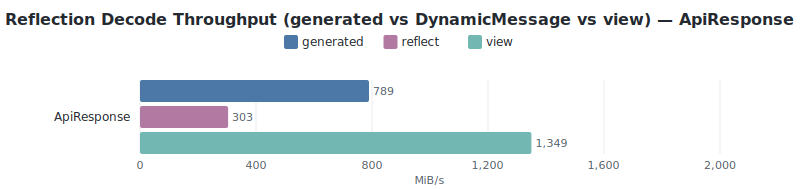
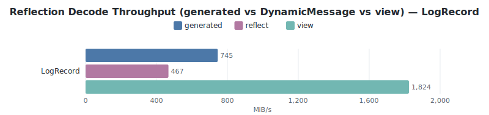
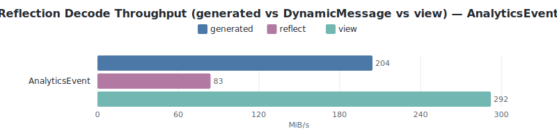
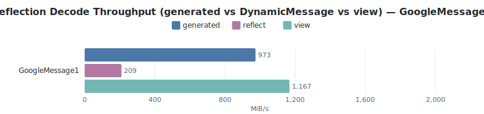

#### Read

The interceptor / field-mask workload: take a wire payload, obtain a reflective handle, and read every set field. This is where vtable mode pays off — it is dominated by the cheap zero-copy decode, so it runs several times faster than either reflection alternative.

- **vtable** — `decode_view`, then read through the borrowed `&dyn ReflectMessage`. No round-trip, no per-field allocation.
- **bridge** — decode the owned message, then round-trip it into a `DynamicMessage` (the cost the codegen `Reflectable` paid per call before vtable mode).
- **dynamic** — decode straight into a `DynamicMessage`, no typed step (pure reflection).

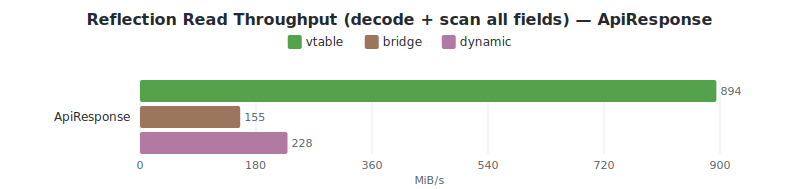
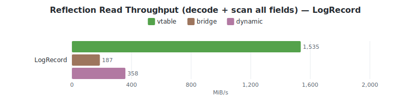
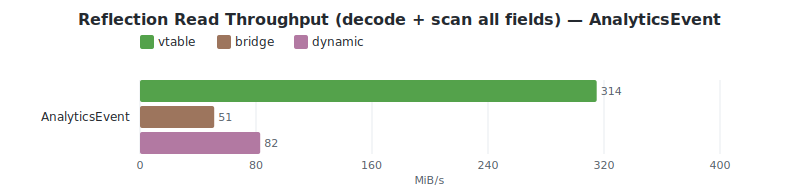
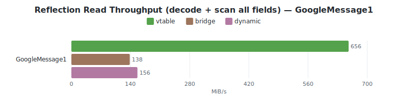

#### Encode

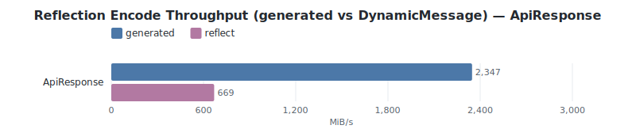
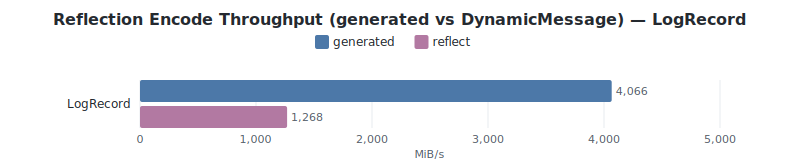
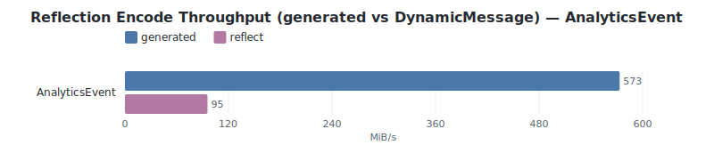
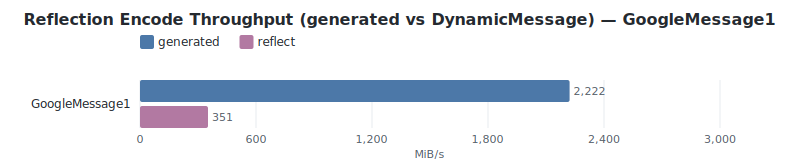

<details><summary>Raw decode data (MiB/s, % vs generated)</summary>

| Message | generated | reflect | view |
|---------|------:|------:|------:|
| ApiResponse | 831 | 320 (−61%) | 1,422 (+71%) |
| LogRecord | 779 | 448 (−42%) | 1,971 (+153%) |
| AnalyticsEvent | 220 | 83 (−62%) | 317 (+44%) |
| GoogleMessage1 | 1,020 | 198 (−81%) | 1,274 (+25%) |

</details>

<details><summary>Raw read data (MiB/s, decode + scan all fields, % vs bridge)</summary>

| Message | vtable | bridge | dynamic |
|---------|------:|------:|------:|
| ApiResponse | 799 (+398%) | 160 | 233 (+46%) |
| LogRecord | 1,462 (+667%) | 191 | 356 (+86%) |
| AnalyticsEvent | 315 (+516%) | 51 | 83 (+62%) |
| GoogleMessage1 | 654 (+351%) | 145 | 153 (+6%) |

</details>

<details><summary>Raw encode data (MiB/s, % vs generated)</summary>

| Message | generated | reflect |
|---------|------:|------:|
| ApiResponse | 2,347 | 670 (−71%) |
| LogRecord | 3,689 | 1,232 (−67%) |
| AnalyticsEvent | 573 | 96 (−83%) |
| GoogleMessage1 | 2,222 | 352 (−84%) |

</details>

**Why the gap, on decode (~1.7–4.7×).** Generated decode resolves each field number through a compile-time jump table and writes the value straight into a typed struct field. Reflective decode instead binary-searches the descriptor's field table for every field, matches on the field's kind at runtime, wraps the value in a `Value` enum, and inserts it into the `BTreeMap` — an ordered-map insertion that allocates a node, where `String`/`Bytes`/nested values carry their own heap allocations and each nested message becomes a fresh `DynamicMessage` with its own map. The spread across messages follows directly: `LogRecord` shows the smallest gap because its payload is dominated by string and map decoding — UTF-8 validation and allocation that *both* paths perform identically — so the fixed per-field reflection overhead is amortized over shared work. `GoogleMessage1` shows the largest gap because it is scalar-dense: the generated path is a tight jump table doing almost nothing per field, leaving the reflection per-field cost nowhere to hide.

**Why the gap is wider on encode (~3.2–7.5×).** The generated encoder threads a `SizeCache` through one size pass, so each nested message's length is computed once and reused when its length prefix is written — this is buffa's linear-time serialization. `DynamicMessage` has no such cache: `encode_to_vec` runs a full `encoded_len()` traversal and then a full `encode()` traversal, and the encode traversal recomputes each nested message's size again to emit its length prefix. On flat messages that is a constant factor on top of the `BTreeMap` walk and per-field wire-type derivation; on deeply nested ones (`AnalyticsEvent`) the repeated size computation compounds with nesting depth.

The **bridge round-trip** is the v1 cost of the encode-decode bridge; a future zero-copy reflection mode would let a generated message expose its fields without re-encoding. For now, the rule is simple: reach for reflection when the schema is only known at runtime, and stay on the generated codec when throughput is what matters.

## Conformance

buffa passes the protobuf binary and JSON conformance test suite (v33.5, editions up to 2024). Both `std` and `no_std` builds pass the full suite including JSON. Run with `task conformance`.

## Compiler compatibility

**[buf](https://buf.build/docs/cli/)** is the recommended way to compile `.proto` files. The buf CLI has its own built-in compiler and can run `protoc-gen-buffa` as a remote plugin on the [Buf Schema Registry](https://buf.build/anthropics/buffa) — `buf generate` sends your compiled proto descriptors to the BSR, which executes the plugin and returns the generated Rust source — so the only thing you need to install is buf itself.

**protoc** is also fully supported. `protoc-gen-buffa` and `buffa-build` work with **protoc v21.12 and later**. The minimum version varies by feature:

| Feature | Minimum protoc |
|---|---|
| Proto2 + proto3 | v21.12 |
| Editions 2023 | v27.0 |
| Editions 2024 | v33.0 |

Note that Linux distro packages (Debian Bookworm, Ubuntu 24.04) ship protoc v21.12, which does not support editions. Install protoc v27+ from [GitHub releases](https://github.com/protocolbuffers/protobuf/releases) or use buf if you need editions support.

Compatibility is tested against protoc v21.12, v22.5, v25.5, v27.3, v29.5, and v33.5 (`task protoc-compat`).

## Minimum supported Rust version

The current MSRV is 1.85.

buffa's MSRV tracks the release ~12 months behind the latest stable, re-evaluated each time a release is cut. Defaulting to the year-old release maximizes compatibility for downstream crates; we move it forward sooner only when a valuable dependency or language feature requires it, and never past the current stable. While buffa is pre-1.0, an MSRV bump is a minor (0.x) release and is noted in the CHANGELOG.

## License

Apache-2.0
