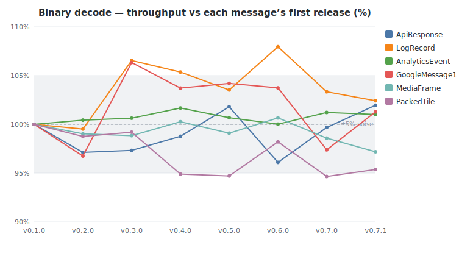
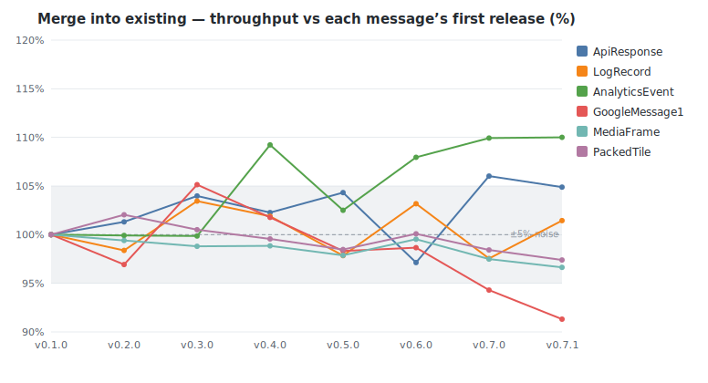
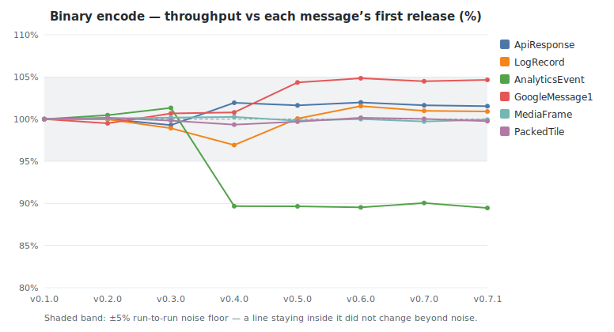
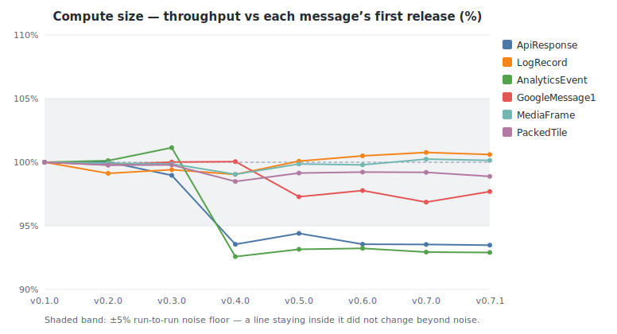
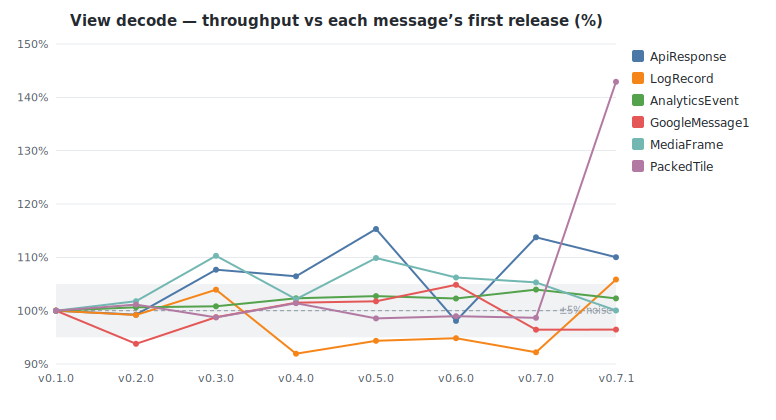

# buffa benchmark history

Throughput of buffa's own protobuf benchmarks across releases, measured on a
dedicated bare-metal box (turbo off, `performance` governor, per-core pinned).
Each release's source is built at one fixed toolchain and profile, held
constant across the series, so a delta reflects buffa's code rather than a
compiler or build-config change. The headline metric is **throughput in
MiB/s**, the median across cores, comparable across releases even when a tag's
dataset changed size. See [README.md](README.md) for methodology and caveats.

<!-- GENERATED by benchmarks/history/generate.py — do not edit by hand. -->

- Releases: v0.1.0, v0.2.0, v0.3.0, v0.4.0, v0.5.0, v0.6.0, v0.7.0, v0.7.1
- Machine: c7i.metal-24xl — Intel(R) Xeon(R) Platinum 8488C
- Tuning: turbo_disabled=1, governor=performance, pin_core=distinct-physical-per-instance
- Build profile: lto=true, codegen-units=1, per-message-isolated (dense)
- Samples: median of 15 cores per release (per-benchmark spread in run files)
- Criterion: 0.5.1 · latest measured at 2026-06-20T20:24:08Z

## Biggest movers (first tracked release → latest)

| Benchmark | First | Latest | Change | Range |
|-----------|------:|-------:|-------:|-------|
| PackedTile / decode_view | 172 | 246 | +43% | v0.1.0→v0.7.1 |
| ApiResponse / decode_view | 955 | 1,051 | +10% | v0.1.0→v0.7.1 |
| AnalyticsEvent / merge | 142 | 156 | +10% | v0.1.0→v0.7.1 |
| LogRecord / decode_view | 1,307 | 1,383 | +6% | v0.1.0→v0.7.1 |
| ApiResponse / merge | 737 | 773 | +5% | v0.1.0→v0.7.1 |
| GoogleMessage1 / encode | 2,048 | 2,119 | +3% | v0.1.0→v0.7.1 |
| LogRecord / encode | 3,048 | 3,124 | +2% | v0.1.0→v0.7.1 |
| LogRecord / decode | 469 | 480 | +2% | v0.1.0→v0.7.1 |
| AnalyticsEvent / encode | 465 | 399 | −14% | v0.1.0→v0.7.1 |
| AnalyticsEvent / compute_size | 1,398 | 1,264 | −10% | v0.1.0→v0.7.1 |
| GoogleMessage1 / merge | 806 | 736 | −9% | v0.1.0→v0.7.1 |
| ApiResponse / compute_size | 7,989 | 7,499 | −6% | v0.1.0→v0.7.1 |
| PackedTile / decode | 226 | 216 | −5% | v0.1.0→v0.7.1 |
| GoogleMessage1 / decode_view | 828 | 798 | −4% | v0.1.0→v0.7.1 |
| MediaFrame / merge | 15,579 | 15,056 | −3% | v0.1.0→v0.7.1 |
| GoogleMessage1 / compute_size | 4,804 | 4,664 | −3% | v0.1.0→v0.7.1 |

All throughput values are MiB/s; higher is better.

## Throughput by operation (MiB/s)

### Binary decode

| Message | v0.1.0 | v0.2.0 | v0.3.0 | v0.4.0 | v0.5.0 | v0.6.0 | v0.7.0 | v0.7.1 |
|---------|------:|------:|------:|------:|------:|------:|------:|------:|
| ApiResponse | 578 | 561 (−3%) | 562 (+0%) | 570 (+1%) | 588 (+3%) | 555 (−6%) | 576 (+4%) | 589 (+2%) |
| LogRecord | 469 | 467 (−0%) | 499 (+7%) | 494 (−1%) | 485 (−2%) | 506 (+4%) | 484 (−4%) | 480 (−1%) |
| AnalyticsEvent | 125 | 125 (+0%) | 126 (+0%) | 127 (+1%) | 126 (−1%) | 125 (−1%) | 126 (+1%) | 126 (−0%) |
| GoogleMessage1 | 547 | 529 (−3%) | 581 (+10%) | 567 (−2%) | 570 (+0%) | 567 (−0%) | 532 (−6%) | 554 (+4%) |
| MediaFrame | 11,950 | 11,834 (−1%) | 11,811 (−0%) | 11,982 (+1%) | 11,842 (−1%) | 12,029 (+2%) | 11,781 (−2%) | 11,614 (−1%) |
| PackedTile | 226 | 223 (−1%) | 224 (+0%) | 215 (−4%) | 214 (−0%) | 222 (+4%) | 214 (−4%) | 216 (+1%) |

### Merge into existing

| Message | v0.1.0 | v0.2.0 | v0.3.0 | v0.4.0 | v0.5.0 | v0.6.0 | v0.7.0 | v0.7.1 |
|---------|------:|------:|------:|------:|------:|------:|------:|------:|
| ApiResponse | 737 | 746 (+1%) | 766 (+3%) | 754 (−2%) | 769 (+2%) | 716 (−7%) | 781 (+9%) | 773 (−1%) |
| LogRecord | 704 | 692 (−2%) | 728 (+5%) | 717 (−2%) | 688 (−4%) | 726 (+5%) | 686 (−5%) | 714 (+4%) |
| AnalyticsEvent | 142 | 142 (−0%) | 142 (−0%) | 155 (+9%) | 145 (−6%) | 153 (+5%) | 156 (+2%) | 156 (+0%) |
| GoogleMessage1 | 806 | 781 (−3%) | 847 (+8%) | 820 (−3%) | 792 (−3%) | 795 (+0%) | 760 (−4%) | 736 (−3%) |
| MediaFrame | 15,579 | 15,486 (−1%) | 15,393 (−1%) | 15,400 (+0%) | 15,248 (−1%) | 15,506 (+2%) | 15,188 (−2%) | 15,056 (−1%) |
| PackedTile | 254 | 260 (+2%) | 256 (−2%) | 253 (−1%) | 251 (−1%) | 255 (+2%) | 250 (−2%) | 248 (−1%) |

### Binary encode

| Message | v0.1.0 | v0.2.0 | v0.3.0 | v0.4.0 | v0.5.0 | v0.6.0 | v0.7.0 | v0.7.1 |
|---------|------:|------:|------:|------:|------:|------:|------:|------:|
| ApiResponse | 1,947 | 1,933 (−1%) | 1,948 (+1%) | 1,963 (+1%) | 1,974 (+1%) | 1,964 (−0%) | 1,960 (−0%) | 1,971 (+1%) |
| LogRecord | 3,048 | 3,008 (−1%) | 3,036 (+1%) | 3,071 (+1%) | 3,056 (−0%) | 3,099 (+1%) | 3,063 (−1%) | 3,124 (+2%) |
| AnalyticsEvent | 465 | 458 (−2%) | 454 (−1%) | 400 (−12%) | 406 (+2%) | 403 (−1%) | 397 (−2%) | 399 (+1%) |
| GoogleMessage1 | 2,048 | 2,012 (−2%) | 2,008 (−0%) | 2,071 (+3%) | 2,111 (+2%) | 2,120 (+0%) | 2,116 (−0%) | 2,119 (+0%) |
| MediaFrame | 25,338 | 25,611 (+1%) | 25,373 (−1%) | 25,423 (+0%) | 25,692 (+1%) | 25,389 (−1%) | 25,609 (+1%) | 25,490 (−0%) |
| PackedTile | 476 | 475 (−0%) | 482 (+1%) | 472 (−2%) | 479 (+2%) | 474 (−1%) | 469 (−1%) | 482 (+3%) |

### Compute size

| Message | v0.1.0 | v0.2.0 | v0.3.0 | v0.4.0 | v0.5.0 | v0.6.0 | v0.7.0 | v0.7.1 |
|---------|------:|------:|------:|------:|------:|------:|------:|------:|
| ApiResponse | 7,989 | 8,010 (+0%) | 7,953 (−1%) | 7,521 (−5%) | 7,568 (+1%) | 7,596 (+0%) | 7,517 (−1%) | 7,499 (−0%) |
| LogRecord | 9,358 | 9,351 (−0%) | 9,386 (+0%) | 9,293 (−1%) | 9,479 (+2%) | 9,463 (−0%) | 9,492 (+0%) | 9,483 (−0%) |
| AnalyticsEvent | 1,398 | 1,367 (−2%) | 1,362 (−0%) | 1,267 (−7%) | 1,265 (−0%) | 1,222 (−3%) | 1,258 (+3%) | 1,264 (+0%) |
| GoogleMessage1 | 4,804 | 4,794 (−0%) | 4,791 (−0%) | 4,788 (−0%) | 4,697 (−2%) | 4,660 (−1%) | 4,646 (−0%) | 4,664 (+0%) |
| MediaFrame | 263,352 | 261,898 (−1%) | 263,455 (+1%) | 261,478 (−1%) | 260,567 (−0%) | 261,530 (+0%) | 260,567 (−0%) | 262,267 (+1%) |
| PackedTile | 1,487 | 1,495 (+1%) | 1,482 (−1%) | 1,462 (−1%) | 1,465 (+0%) | 1,463 (−0%) | 1,476 (+1%) | 1,472 (−0%) |

### View decode

| Message | v0.1.0 | v0.2.0 | v0.3.0 | v0.4.0 | v0.5.0 | v0.6.0 | v0.7.0 | v0.7.1 |
|---------|------:|------:|------:|------:|------:|------:|------:|------:|
| ApiResponse | 955 | 948 (−1%) | 1,028 (+8%) | 1,016 (−1%) | 1,101 (+8%) | 937 (−15%) | 1,086 (+16%) | 1,051 (−3%) |
| LogRecord | 1,307 | 1,296 (−1%) | 1,358 (+5%) | 1,201 (−12%) | 1,233 (+3%) | 1,239 (+1%) | 1,205 (−3%) | 1,383 (+15%) |
| AnalyticsEvent | 196 | 197 (+1%) | 197 (+0%) | 200 (+2%) | 201 (+0%) | 200 (−0%) | 203 (+2%) | 200 (−2%) |
| GoogleMessage1 | 828 | 776 (−6%) | 817 (+5%) | 840 (+3%) | 842 (+0%) | 868 (+3%) | 798 (−8%) | 798 (+0%) |
| MediaFrame | 43,950 | 44,730 (+2%) | 48,472 (+8%) | 44,892 (−7%) | 48,290 (+8%) | 46,683 (−3%) | 46,281 (−1%) | 43,964 (−5%) |
| PackedTile | 172 | 174 (+1%) | 170 (−2%) | 174 (+3%) | 170 (−3%) | 170 (+0%) | 170 (−0%) | 246 (+45%) |

## JSON operations — directional only

These numbers are **not trustworthy to ~20%**: the JSON serialize /
deserialize path through serde is dominated by build-time code layout,
which a rebuild of the identical source can shift by that much with no
code change (proven by disassembly — see [annotations.md](annotations.md)).
No charts are drawn and they are excluded from the biggest-movers table.
Trust only large, persistent steps; treat anything within ±20% of a
baseline as build noise.

### JSON encode

| Message | v0.1.0 | v0.2.0 | v0.3.0 | v0.4.0 | v0.5.0 | v0.6.0 | v0.7.0 | v0.7.1 |
|---------|------:|------:|------:|------:|------:|------:|------:|------:|
| ApiResponse | 511 | 506 (−1%) | 573 (+13%) | 508 (−11%) | 571 (+12%) | 500 (−13%) | 558 (+12%) | 500 (−10%) |
| LogRecord | 675 | 675 (−0%) | 658 (−2%) | 656 (−0%) | 876 (+34%) | 683 (−22%) | 877 (+28%) | 657 (−25%) |
| AnalyticsEvent | 528 | 497 (−6%) | 485 (−2%) | 493 (+2%) | 501 (+2%) | 488 (−3%) | 490 (+0%) | 493 (+1%) |
| GoogleMessage1 | 530 | 543 (+2%) | 653 (+20%) | 530 (−19%) | 542 (+2%) | 536 (−1%) | 524 (−2%) | 531 (+1%) |
| MediaFrame | 700 | 709 (+1%) | 981 (+38%) | 710 (−28%) | 723 (+2%) | 981 (+36%) | 964 (−2%) | 982 (+2%) |
| PackedTile | 388 | 378 (−3%) | 377 (−0%) | 365 (−3%) | 366 (+0%) | 364 (−0%) | 364 (−0%) | 365 (+0%) |

### JSON decode

| Message | v0.1.0 | v0.2.0 | v0.3.0 | v0.4.0 | v0.5.0 | v0.6.0 | v0.7.0 | v0.7.1 |
|---------|------:|------:|------:|------:|------:|------:|------:|------:|
| ApiResponse | 460 | 468 (+2%) | 449 (−4%) | 461 (+3%) | 467 (+1%) | 475 (+2%) | 470 (−1%) | 471 (+0%) |
| LogRecord | 466 | 464 (−1%) | 446 (−4%) | 462 (+3%) | 466 (+1%) | 460 (−1%) | 475 (+3%) | 465 (−2%) |
| AnalyticsEvent | 176 | 175 (−1%) | 170 (−3%) | 172 (+1%) | 175 (+2%) | 174 (−0%) | 177 (+1%) | 178 (+1%) |
| GoogleMessage1 | 400 | 395 (−1%) | 409 (+4%) | 390 (−5%) | 401 (+3%) | 402 (+0%) | 412 (+2%) | 401 (−3%) |
| MediaFrame | 1,218 | 1,240 (+2%) | 1,217 (−2%) | 1,235 (+2%) | 1,222 (−1%) | 1,222 (+0%) | 1,220 (−0%) | 1,221 (+0%) |
| PackedTile | 194 | 198 (+2%) | 193 (−3%) | 189 (−2%) | 190 (+1%) | 189 (−0%) | 190 (+0%) | 192 (+1%) |

## Measurement spread (core-to-core)

Spread of the per-benchmark median across cores, summarised per operation
over all messages and releases. A delta in the tables above smaller than
the operation's spread here is noise, not signal.

| Operation | Median spread | p90 spread | Max |
|-----------|--------------:|-----------:|----:|
| Binary decode | 1.9% | 6.8% | 24.1% |
| Merge into existing | 2.9% | 6.6% | 26.5% |
| Binary encode | 3.7% | 10.4% | 22.5% |
| Compute size | 1.8% | 2.7% | 3.4% |
| View decode | 2.8% | 6.3% | 6.5% |
| JSON encode | 2.4% | 8.8% | 11.4% |
| JSON decode | 3.1% | 6.2% | 19.1% |
